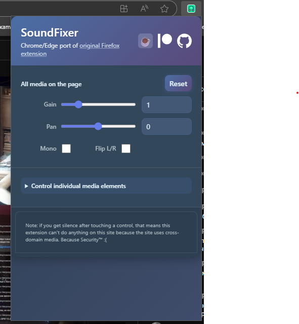

# SoundFixer for Chrome & Edge

🎵 **Chrome/Edge port** of the popular Firefox SoundFixer extension! 

Fix annoying sound problems in web videos: sound in one channel only, too quiet or too loud.

> **Fork** of the original [SoundFixer for Firefox](https://github.com/valpackett/soundfixer) by [Val Packett](https://github.com/valpackett).

## Features

- **Volume Control** - Increase/decrease volume beyond system limits
- **Audio Panning** - Shift sound left/right  
- **Mono Mode** - Combine left and right channels
- **Channel Swap** - Flip left and right channels

## Installation

### Chrome:
1. Open `chrome://extensions/` → Enable "Developer mode" → "Load unpacked"

### Edge:
1. Open `edge://extensions/` → Enable "Developer mode" → "Load unpacked"

## What's Changed

- ✅ Manifest V3 (Chrome/Edge compatible)
- ✅ Chrome API instead of Firefox API
- ✅ Modern UI design

Works great on YouTube and most video sites!

## Support

If you find this extension useful, consider [buying me a coffee](https://buymeacoffee.com/n6223221) ☕

## License

Public domain ([Unlicense](https://unlicense.org))
